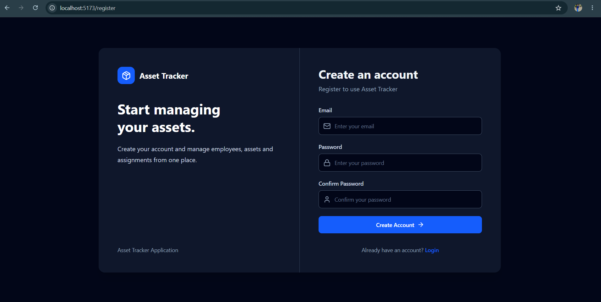
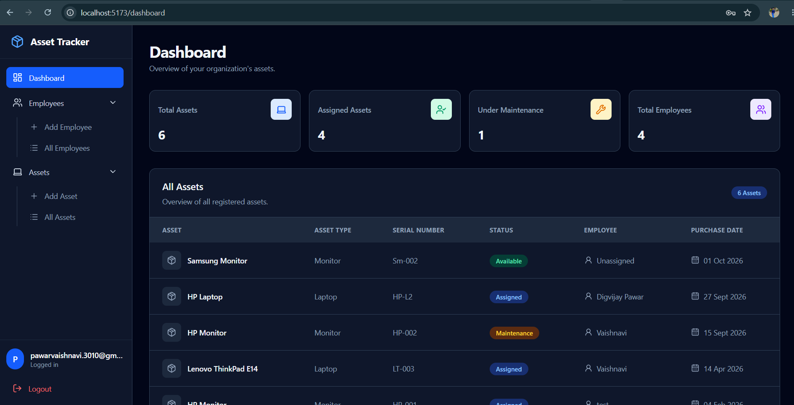
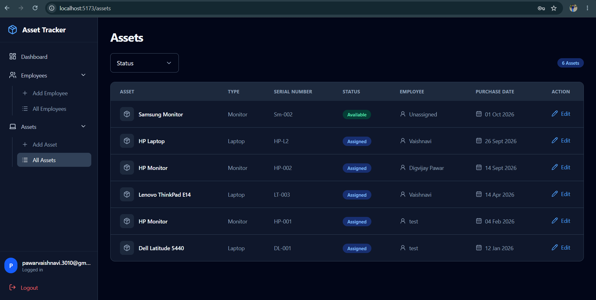
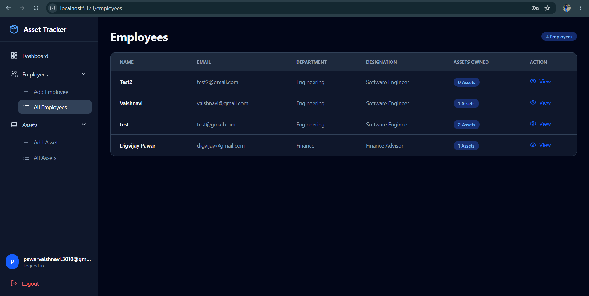
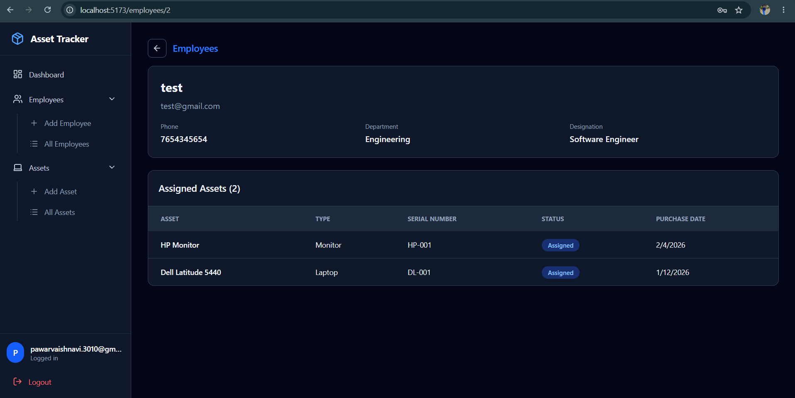

# Asset Tracker

Asset Tracker is a full-stack application for managing organizational assets and employees. It provides authenticated access to an asset inventory, employee records, assignment details, asset status, and purchase information.

The project is designed as a production-style deployment exercise using React, Node.js, PostgreSQL, Docker, GitHub Actions, Docker Hub, and Kubernetes.

## Screenshots

Add screenshots for the main application modules in the placeholders below.

### Login and registration




### Dashboard



### Asset management



### Employee management




## Highlights

- JWT-based user authentication with registration, login, logout, access tokens, and refresh tokens
- Protected application routes and protected backend APIs
- Dashboard with asset and employee statistics
- Asset inventory with asset type, serial number, status, assigned employee, and purchase date
- Asset creation and editing
- Asset filtering by status
- Employee creation, listing, details, and assigned-asset views
- PostgreSQL persistence with initialization and seed scripts
- Docker Compose for local multi-container development
- Multi-stage Dockerfiles for optimized frontend and backend images
- Docker Hub image publishing through GitHub Actions
- Kubernetes manifests for deployments, services, configuration, secrets, PostgreSQL storage, and frontend autoscaling
- Automated linting, tests, dependency scanning, secret scanning, SAST, container scanning, and DAST workflows

## Architecture

```text
                         User
                           │
                           ▼
                    React + Vite UI
                         :5173
                           │
                           │ /api requests
                           ▼
                  Node.js + Express API
                         :5000
                           │
                           ▼
                    PostgreSQL database
                         :5432
```

### CI/CD and image flow

```text
                          GitHub repository
                                  │
                                  ▼
                         GitHub Actions workflows
                                  │
            ┌─────────────────────┼─────────────────────┐
            ▼                     ▼                     ▼
       Lint and tests       Security checks       Docker build
                                                        │
                                                        ▼
                                                  Docker Hub
                                                        │
                                  ┌─────────────────────┴─────────────────────┐
                                  ▼                                           ▼
                           Docker Compose                              Kubernetes cluster
```

## Technology stack

### Frontend

- React 19
- React Router
- Vite
- Tailwind CSS
- Lucide React icons
- Vitest
- ESLint

### Backend

- Node.js 22
- Express 5
- PostgreSQL client (`pg`)
- JSON Web Tokens (`jsonwebtoken`)
- Password hashing with `bcryptjs`
- CORS
- Vitest
- ESLint

### Platform and delivery

- Docker and Docker Compose
- Multi-stage Docker builds
- Docker Hub
- GitHub Actions
- Kubernetes
- PostgreSQL 17

## Application modules

### Authentication

The application supports user authentication through:

- Registration with email and password validation
- Login with bcrypt password verification
- Short-lived JWT access tokens
- Refresh tokens stored for the authenticated user
- Logout that clears the stored refresh token
- Protected frontend routes
- Protected asset and employee API routes

Authentication endpoints:

| Method | Endpoint | Access |
| --- | --- | --- |
| `POST` | `/api/auth/register` | Public |
| `POST` | `/api/auth/login` | Public |
| `POST` | `/api/auth/logout` | Bearer token required |

### Dashboard

The dashboard displays:

- Total assets
- Assigned assets
- Assets under maintenance
- Total employees
- A summary table of registered assets

### Asset management

Authenticated users can:

- View all assets
- Add new assets
- Edit existing assets
- Filter assets by status
- Track asset type and serial number
- Assign assets to employees
- Record asset status and purchase date

Asset endpoints:

| Method | Endpoint | Access |
| --- | --- | --- |
| `GET` | `/api/assets` | Bearer token required |
| `GET` | `/api/assets/:id` | Bearer token required |
| `POST` | `/api/assets` | Bearer token required |
| `PUT` | `/api/assets/:id` | Bearer token required |
| `DELETE` | `/api/assets/:id` | Bearer token required |

### Employee management

Authenticated users can:

- Add employees
- View all employees
- View employee details
- View assets assigned to an employee
- Update employee information

Employee endpoints:

| Method | Endpoint | Access |
| --- | --- | --- |
| `POST` | `/api/employees` | Bearer token required |
| `GET` | `/api/employees` | Bearer token required |
| `GET` | `/api/employees/:id` | Bearer token required |
| `GET` | `/api/employees/:id/assets` | Bearer token required |
| `PUT` | `/api/employees/:id` | Bearer token required |

## Repository structure

```text
simple_nodejs_app/
├── backend/
│   ├── src/
│   │   ├── config/              # Database configuration
│   │   ├── controllers/         # Authentication, asset, and employee logic
│   │   ├── middlewares/         # JWT authentication middleware
│   │   ├── routes/              # Express API routes
│   │   └── server.js            # API entry point
│   ├── init/postgres/           # Database initialization and seed SQL
│   ├── Dockerfile.multistage
│   └── package.json
├── frontend/
│   ├── src/
│   │   ├── components/          # Shared UI components
│   │   ├── pages/               # Application screens
│   │   └── services/            # API and authentication services
│   ├── Dockerfile.multistage
│   ├── vite.config.js
│   └── package.json
├── kind/                        # Kubernetes namespace, workloads, services, and storage
├── .github/workflows/           # CI/CD and security workflows
├── docker-compose.yml           # Local multi-container runtime
├── .env.example                 # Environment variable template
└── README.md
```

## Environment configuration

Copy the example file before running the application:

```bash
cp .env.example .env
```

On Windows PowerShell:

```powershell
Copy-Item .env.example .env
```

Example local values:

```env
POSTGRES_DB=asset_tracker
POSTGRES_USER=postgres
POSTGRES_PASSWORD=postgres
POSTGRES_HOST=postgres
POSTGRES_PORT=5432
POSTGRES_HOST_PORT=5430

BACKEND_PORT=5000
BACKEND_HOST_PORT=5000
FRONTEND_HOST_PORT=5173

JWT_ACCESS_SECRET=replace-with-a-long-access-secret
JWT_REFRESH_SECRET=replace-with-a-long-refresh-secret
```

Do not commit real passwords or JWT secrets. Use repository or environment secrets for shared deployments.

## Run locally with Docker Compose

### Prerequisites

- Git
- Docker Desktop or Docker Engine
- Docker Compose v2

### Start the application

```bash
git clone https://github.com/vaishnavipawardottech/simple_nodejs_app.git
cd simple_nodejs_app
cp .env.example .env
docker compose up -d
```

On Windows PowerShell, use `Copy-Item .env.example .env` instead of `cp`.

Check service status:

```bash
docker compose ps
```

Follow logs:

```bash
docker compose logs -f frontend
docker compose logs -f backend
```

Open the application:

- Frontend: <http://localhost:5173>
- Dashboard: <http://localhost:5173/dashboard>
- Backend health check: <http://localhost:5000/health>

Stop the application:

```bash
docker compose down
```

To remove the database volume as well:

```bash
docker compose down -v
```

The database initialization scripts are mounted from `backend/init/postgres`. PostgreSQL data is persisted in the `postgres_data` Docker volume.

## Run without Docker

### Start the backend

```bash
cd backend
npm ci
npm start
```

The backend listens on port `5000` by default.

### Start the frontend

In a second terminal:

```bash
cd frontend
npm ci
npm run dev
```

The Vite development server listens on port `5173`. The development proxy forwards `/api` requests to the backend.

## Testing and code quality

Run frontend checks:

```bash
cd frontend
npm ci
npm run lint
npm run test
npm run build
```

Run backend checks:

```bash
cd backend
npm ci
npm run lint
npm run test
```

## Multi-stage Docker builds

Both services use `Dockerfile.multistage`.

### Build stages

1. The builder stage installs dependencies and performs the frontend build where applicable.
2. The runtime stage contains the application runtime and the files needed to start the service.

This keeps build tooling out of the final runtime image and produces smaller deployment artifacts.

Build the images locally:

```bash
docker build -f frontend/Dockerfile.multistage \
  -t <DOCKER_USERNAME>/asset-tracker-frontend:latest frontend

docker build -f backend/Dockerfile.multistage \
  -t <DOCKER_USERNAME>/asset-tracker-backend:latest backend
```

Run the images with Compose by updating the image tags in `docker-compose.yml`, or use the checked-in Compose configuration to pull the published images.

## Docker Hub publishing

Log in to Docker Hub:

```bash
docker login
```

Push the images:

```bash
docker push <DOCKER_USERNAME>/asset-tracker-frontend:latest
docker push <DOCKER_USERNAME>/asset-tracker-backend:latest
```

The GitHub Actions Docker workflows publish images using the configured Docker Hub username:

```text
<DOCKER_USERNAME>/asset-tracker-frontend:<tag>
<DOCKER_USERNAME>/asset-tracker-backend:<tag>
```

Keep the image tags in `docker-compose.yml` and the Kubernetes deployment manifests synchronized with the tags published to Docker Hub.

## Kubernetes deployment

The `kind/` directory contains Kubernetes resources for:

- `asset-tracker-ns` namespace
- Frontend and backend deployments
- Frontend NodePort service
- Backend ClusterIP service
- PostgreSQL StatefulSet
- PostgreSQL service
- PersistentVolume and PersistentVolumeClaim configuration
- ConfigMap and Secret configuration
- PostgreSQL initialization ConfigMap
- Frontend HorizontalPodAutoscaler

The Kubernetes frontend service exposes NodePort `30001`. The backend is reachable inside the cluster through the `backend` service on port `5000`.

### Prerequisites

- A Kubernetes cluster such as kind, Minikube, Docker Desktop Kubernetes, or a managed cluster
- `kubectl` configured for the target cluster
- Access to the Docker Hub images referenced by the deployment manifests

### Apply the manifests

From the repository root:

```bash
kubectl apply -f kind/
```

Check the resources:

```bash
kubectl get all -n asset-tracker-ns
kubectl get pvc -n asset-tracker-ns
kubectl get hpa -n asset-tracker-ns
```

View logs:

```bash
kubectl logs deployment/backend-deployment -n asset-tracker-ns
kubectl logs deployment/frontend-deployment -n asset-tracker-ns
```

Access the frontend:

```bash
kubectl get service frontend -n asset-tracker-ns
```

For a local kind or Minikube cluster, use the cluster-specific NodePort access method. With Minikube:

```bash
minikube service frontend -n asset-tracker-ns
```

Before applying a new image version, update the `image` values in:

- `kind/03_frontend_deployment.yml`
- `kind/05_backend_deployment.yml`

Delete the Kubernetes resources:

```bash
kubectl delete namespace asset-tracker-ns
```

## GitHub Actions CI/CD

The repository contains reusable workflows for quality, security, image publishing, and deployment.

### Main workflows

| Workflow | Purpose |
| --- | --- |
| `ci.yml` | Runs reusable lint/test and Docker build workflows |
| `cicd.yml` | Runs lint/tests, builds and pushes images, then deploys |
| `devsecops-pipeline.yml` | Runs security scans before image publishing and deployment |
| `lint-and-test.yml` | Runs ESLint and Vitest for frontend and backend |
| `docker.yml` | Builds and pushes multi-stage images |
| `docker_push.yml` | Publishes Docker images after scanning |
| `deploy.yml` | Pulls images and starts the Compose application on a self-hosted runner |
| `dependency_scan.yml` | Scans project dependencies |
| `secrets-scanning.yml` | Scans for accidentally committed secrets |
| `sonar-scan.yml` | Runs static analysis |
| `trivy_scans.yml` | Scans container images |
| `dast.yml` | Runs dynamic application security testing |

The top-level workflows are currently configured for manual execution with `workflow_dispatch`. Push triggers can be enabled in the workflow files when desired.

### CI/CD sequence

```text
Checkout
  ↓
Install dependencies
  ↓
Lint and test frontend + backend
  ↓
Build and scan Docker images
  ↓
Push images to Docker Hub
  ↓
Deploy with Docker Compose
```

The DevSecOps workflow adds secret scanning, SAST, dependency scanning, container scanning, and DAST gates before deployment.

### Required GitHub configuration

Configure these repository values before running the publishing workflows:

| Type | Name | Purpose |
| --- | --- | --- |
| Variable | `DOCKER_USERNAME` | Docker Hub username |
| Secret | `DOCKER_TOKEN` | Docker Hub access token |
| Secret | `POSTGRES_DB` | Deployment database name |
| Secret | `POSTGRES_USER` | Deployment database user |
| Secret | `POSTGRES_PASSWORD` | Deployment database password |

The deployment workflow uses a self-hosted runner with Docker and Docker Compose installed. It checks out the repository, creates `.env`, pulls the published images, and starts the services.

## Security notes

- Never commit `.env` files containing real credentials.
- Use strong, unique JWT access and refresh secrets.
- Use a Docker Hub access token instead of a Docker Hub password.
- Restrict PostgreSQL exposure in production; the published Compose file exposes it for local development.
- Store Kubernetes secrets in a managed secret solution or a sealed/external secret workflow for production.
- Review image tags and scan results before deployment.

## Troubleshooting

### Frontend loads but API calls fail

Check that the backend is running and that the frontend proxy target points to the backend service:

```bash
docker compose ps
docker compose logs backend
curl http://localhost:5000/health
```

When running in Compose, containers must use the service name `backend` to reach the backend—not `localhost`.

### Database connection errors

Check PostgreSQL health and the backend environment:

```bash
docker compose ps
docker compose logs postgres
docker compose logs backend
```

Inside Compose, the backend should use `DB_HOST=postgres` and `DB_PORT=5432`.

### Kubernetes pods are not ready

Inspect pod events and container logs:

```bash
kubectl get pods -n asset-tracker-ns
kubectl describe pod <pod-name> -n asset-tracker-ns
kubectl logs <pod-name> -n asset-tracker-ns
```

Verify that the referenced Docker Hub image tags exist and that the ConfigMap and Secret were applied.

## License

This project is licensed under the ISC license as declared in the package manifests.
